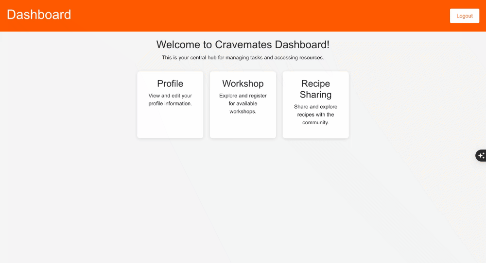

# SWEN746-GroupFour
# PROJECT Design Documentation
    

> _The following template provides the headings for your Design
> Documentation.  As you edit each section make sure you remove these
> commentary 'blockquotes'; the lines that start with a > character
> and appear in the generated PDF in italics._

## Team Information
* Team name: Group Four
* Team members
  * Nithikesh Reddy Bobbili
  * Sreeja Reddy Bobbili

## Executive Summary

Food Connections will be a web application designed to connect people who want to connect with others over food.The users of this application will be students/staff/faculty on RIT campus. Furthermore, users can be categorized into four areas: Hosts, Organizations, Applicants and Users.

Our application will allow users to do a number of different things around one common interest, food. Hosts will be able to host a group meal or a group activity. This can include anything from organizing a restaurant group link-up, organizing a group meal, potluck, organizing meals for when campus is on break, sharing recipes, holding cook-offs and cooking videos, and renting out kitchen/dining spaces. Additionally the host will be able to set preferences for who can apply (ie. only females if the hosts apartment is only female). Furthermore the host can detail their own interests and what they would like to talk about over the course of the meal so that people with similar interests can apply to meals where they want to talk to the people there. Hosts will also be able to tag their with both the type of food (Thai, American, etc) and potential allergies or allergy friendliness (Peanut, Soy, etc). Organizations on campus will also be users on our web application. They will be able to host food drives, cook-offs and any volunteer based event involving food. Users will have full access to join any host/organization event they would like. They will be able to share recipes and do a lot of what the host can do but on a secondary level. Meanwhile, Applicants to a meal will then be able either volunteer cooking expertise or groceries when they apply for a meal.

## Requirements

The app will provide a platform for users to engage in various food-related activities, including hosting group meals, potlucks, and cooking workshops. The application will categorize users into Hosts, Organizations, Applicants, and Users, each with tailored functionalities to enhance community interaction. Additionally, the app will allow Hosts to set participant preferences, tag events with food types and allergy information, and enable Organizations to run food-related events, ensuring a vibrant and inclusive environment for all users.

### Definition of MVP

CraveMates/Sustenance is a social platform that brings food enthusiasts together through shared culinary experiences. Users can host or join potluck events, cooking workshops, and weekly restaurant groups, catering to diverse food preferences and dietary needs. The app includes a news feed for open communication, channels for sharing recipes, and a tagging system for allergies, ensuring transparency and inclusivity. Profiles showcase users’ culinary journeys, while hosts can also list kitchens or dining spaces for rent, fostering a vibrant community centered around food.

### MVP Features
* One feature of the app will include the ability to create and host a “potluck event” where people can sign up for different food items or parts of a recipe.
* One feature of the app will allow a host to create a poll of meal preferences before they launch their event. This will allow hosts to plan a menu that everyone will enjoy.
* One feature of the app will include the ability of a host to organize a cooking workshop. 
* One feature of the app will allow a host to create a group for people to join where they will visit restaurants every week. This is a specific feature but hosts will be able to create groups based on their preferences as well. Users will also be able to join these groups.
* One feature of this app will include a news feed where hosts and users can communicate openly. All will have the ability to reply, like and re-share posts. 
* One feature of this app will include channels for food categories so users and hosts can share or look at other recipes.
* One feature of this app will include a profile for users and hosts. In the profile you can see pictures, videos, past events, and a bio of the applicant. The profile will also have a private messaging system.
* One feature of this app will include a tagging feature. This will allow for hosts to tag allergies on events and users can add this feature onto their profile as well for transparency. 
* One feature of this app will allow hosts to post listings on kitchens/dining spaces to rent out.
* One feature of this app will feature a follow button so users can follow their favorite pages, groups, hosts, and etc.

### Acceptance Criteria

Feature 1: 
  One feature of the app will include the ability to create and host a “potluck event” where people can sign up for different food items or parts of a recipe.

  Criteria I:
    Given that I'm a user when I log on I will see an option to register as a host.

  Criteria II:
    App displays an option for a host to create an event.

  Criteria III:
    Host will be able upload up to 6 pictures/videos to the event and a short description that is no longer than 500 characters.

  Criteria IV:
    The event will feature a news feed that can be filtered by popularity/recency.

  Criteria V:
    Will include a public list of members who joined the event.

Feature 2:
  One feature of the app will allow a host to create a poll of meal preferences before they launch their event. This will allow hosts to plan a menu that everyone will enjoy.

  Criteria I:
    Displays an option to create a poll.

  Criteria II:
    User will be prompted to register as host if they aren't currently one before creating poll.

  Criteria III:
    Has an option for the host to write a short description that is no longer than 500 characters.

Feature 3:
  One feature of the app will include the ability of a host to organize a cooking workshop. 

  Criteria I:
    Shows all available event channels where events are being hosted.

  Criteria II:
    User can select which events they would want to participate in and register for the events selected. Only stopping them if there is an overlap in terms of time.

  Criteria III:
    User can see the location and starting time of the event. Alongside any tools or ingredients they would need to bring with them.

Feature 4:
  One feature of the app will allow a host to create a group for people to join where they will visit restaurants every week. This is a specific feature but hosts will be able to create groups based on their preferences as well. Users will also be able to join these groups.

  Criteria I:
    Host can select which Users and Resturants that coencide with User and Host preferences along with date and time of meeting

  Criteria II:
    Host can modify event details, such as the restaurant of choice, members that are attending, along with time and date of the event.
  
  Criteria III:
    User can view the details of an event made by the Host and register for the same event if they have similar interests. Users can also tell the Host of any potential allergies they may have.
    
Feature 5:
  One feature of this app will include a news feed where hosts and users can communicate openly. All will have the ability to reply, like and re-share posts. 

  Criteria I:
    The news feed and replies will be sorted by recency of posts.

  Criteria II:
    Users will be able filter for only posts they have liked or have replied to or from users they are following.

  Criteria III:
    Users will be able to create posts linking up to 1 media file and a limited amount of text, the same restriction will apply to replies.

  Criteria IV:
    Users will be able to like posts which the total amount of likes a post has will be viewable by other users

  Criteria V:
    Users will be able to reshare posts which will then be visible to people filtering for posts from people they follow.

Feature 6: 
  One feature of this app will include channels for food categories so users and hosts can share or look at other recipes

  Criteria I:
    Recipes posted in a channel will be sortable based on either the posts popularity or its recency

  Criteria II:
    Recipes will have different fields for the user to fill out including ingredients, background, and instructions

  Criteria III:
    New channels will be able to be proposed by users which can then be approved by staff

Feature 7:

  Criteria I: Hosts can upload photos and event descriptions after an event.

  Criteria II: Event highlights are displayed on the Host's profile or event page.

  Criteria III: Users can browse past event galleries when considering whether to attend future events.

  Criteria IV: Photos are organized by event and include captions.

  Criteria V: Hosts can tag attendees in event photos, and Users are notified when they are tagged.

Feature 8:

  Criteria I: Hosts can input and tag food allergies when creating an event.

  Criteria II: Users can filter events by allergy-friendly options (e.g., nut-free, gluten-free).

  Criteria III: Users can see clear labels for food allergies on all events and meals.

  Criteria IV: The system warns Users during sign-up if an event contains allergens they are allergic to (based on their profile).

  Criteria V: Users can add or update their dietary restrictions in their profile at any time.

Feature 9:
  As a Host, I want to be able to rent out my space so that others can have a safe place to cook and eat.

  Criteria I: Hosts must be able to list their space on the platform by providing details such as location, size, available facilities, and rental price.

  Criteria II: Each listing must include photos of the space, a description of the amenities provided, and any specific rules or restrictions.

  Criteria III: Users can search for rental spaces based on criteria such as location, size, and available dates.

  Criteria IV: The platform must allow users to book a space directly from the listing with a visible 'Book Now' button.

  Criteria V: Upon booking, both hosts and users receive an immediate email confirmation with rental details, including date, time, and any access instructions.

  Criteria VI: The system must provide a secure payment gateway for users to pay for the rental space directly through the platform.

Feature 10:
  As a User, I want to follow my favorite hosts and organizations so that I receive updates about their upcoming events and activities.

  Criteria I: Users must be able to browse profiles of hosts and organizations through the platform.

  Criteria II: Each host and organization profile should have a 'Follow' button that users can click to start following.

  Criteria III: Upon clicking the 'Follow' button, the system should immediately update to show that the user is following the host or organization.

  Criteria IV: Users should receive a confirmation notification on the platform once they successfully follow a host or organization.

  Criteria V: Users who follow hosts or organizations must receive updates in their platform inbox or via email about upcoming events and activities.

## Architecture and Design

This section describes the application architecture.

### Software Architecture
Client-Server
https://drive.google.com/file/d/1AB5WjstdRSIT5p8r0J1nPFobZM_2X9jO/view?usp=sharing

### Use Cases
[>[https://app.diagrams.net/#G136MkRWYkHQoQGQWcl4y6KXNJhaMpu6eY#%7B%22pageId%22%3A%22F8eIRIGPohrmfdewEcGW%22%7D](https://drive.google.com/file/d/136MkRWYkHQoQGQWcl4y6KXNJhaMpu6eY/view?usp=sharing)](https://drive.google.com/file/d/136MkRWYkHQoQGQWcl4y6KXNJhaMpu6eY/view?usp=sharing)

### Domain Model
[https://drive.google.com/file/d/1bzHemqDtCy4JB4jsuLDE4F8ABgXerbe_/view?usp=sharing](https://app.diagrams.net/#G1bzHemqDtCy4JB4jsuLDE4F8ABgXerbe_#%7B%22pageId%22%3A%22sXF_qgFIhSkNeDmUX0QF%22%7D)

### Sequence Diagram
https://app.diagrams.net/#G1YT0xIK81bcvwysMcXhDiFJb0tk1THE73#%7B%22pageId%22%3A%22ShmrYyQRlPPg4B9SsioZ%22%7D
https://drive.google.com/file/d/1YT0xIK81bcvwysMcXhDiFJb0tk1THE73/view?usp=sharing

### Class Diagram
https://drive.google.com/file/d/1IOUmy6L-ris5MdbeLZ-2XgavSlhCtZ2R/view?usp=sharing
https://app.diagrams.net/#G1IOUmy6L-ris5MdbeLZ-2XgavSlhCtZ2R#%7B%22pageId%22%3A%22sXF_qgFIhSkNeDmUX0QF%22%7D

### Signup

### Login

### Profile

### Workshop

### Reciepes
   

## Installation Requirements

### Prerequisites
- **Programming Language**: Python 3.9 or higher
- **Frameworks**: Flask, React
- **Database**: PostgreSQL 14
- **Version Control**: Git
- **Other Tools**: Node.js, npm

